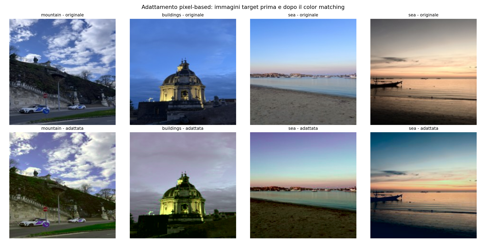
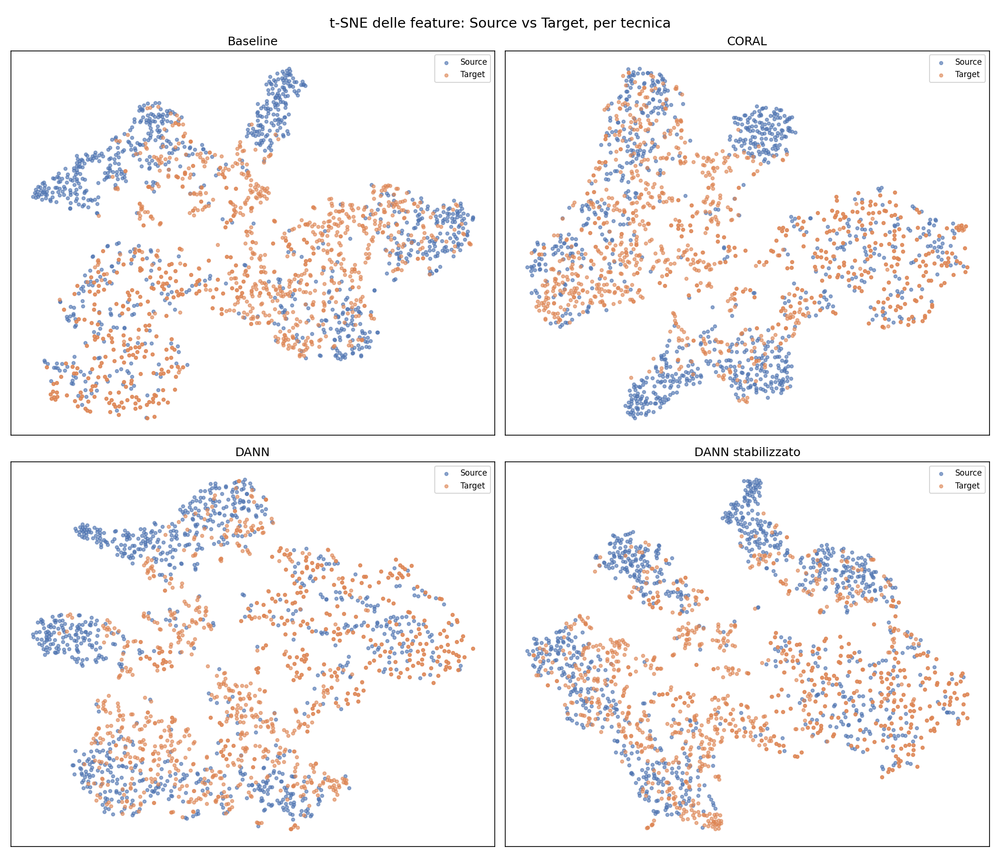
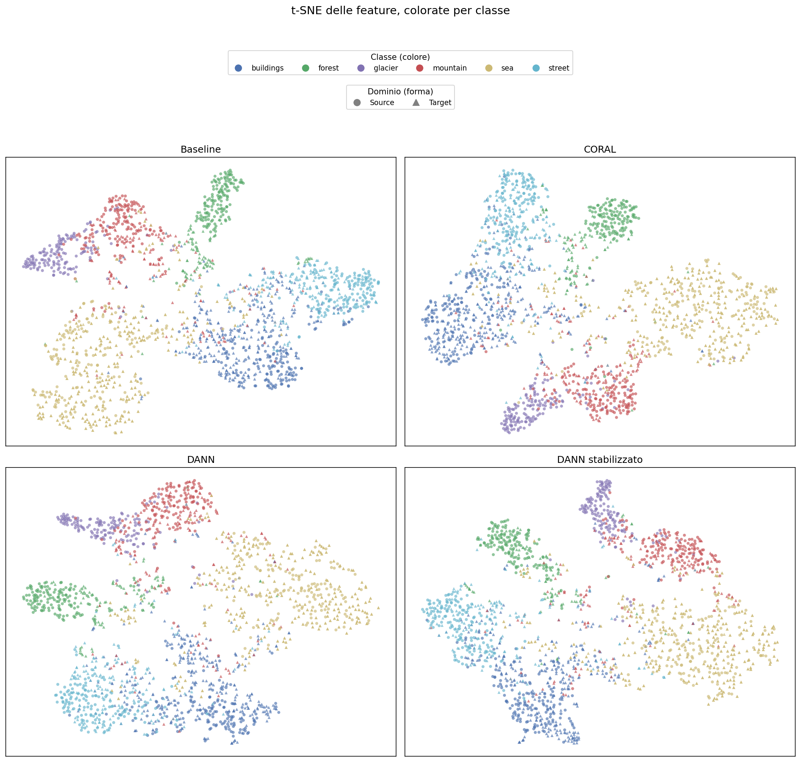
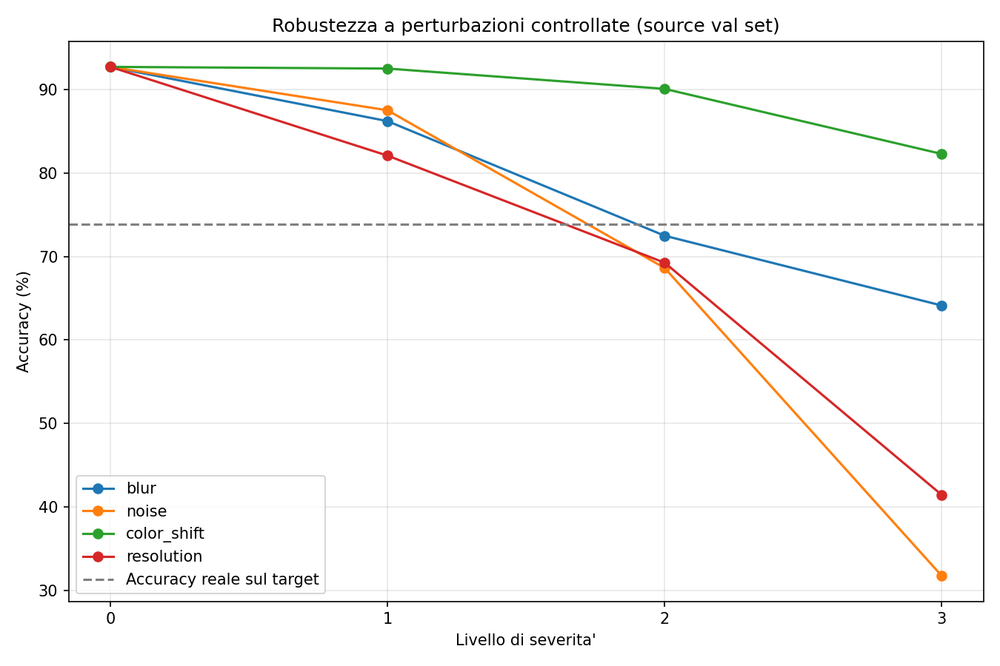
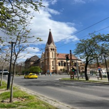
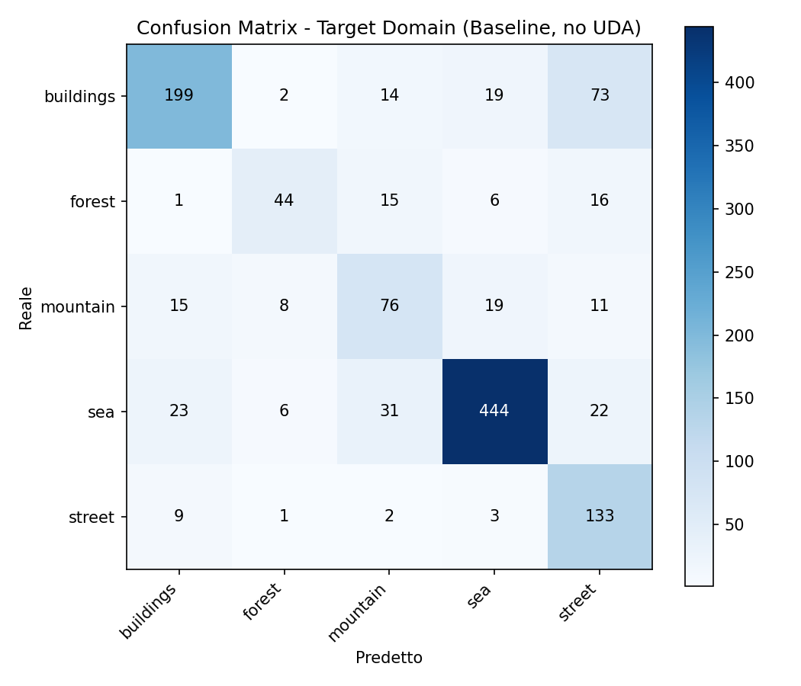

# Unsupervised Domain Adaptation per il riconoscimento di scene sotto domain shift

- **Group ID**: G31
- **Project ID**: 30
- **Autore**: Gianluca Diquattro

---

## 1. Introduzione e obiettivo

Un classificatore di immagini addestrato su un dataset specifico tende a perdere accuratezza quando viene valutato su immagini provenienti da una fonte diversa. Questo fenomeno, detto _domain shift_, è una delle cause principali per cui modelli che funzionano bene in laboratorio deludono una volta messi in uso su dati reali.

Il progetto ha tre obiettivi. Il primo è **quantificare** il domain shift tra un dataset pubblico di scene naturali e urbane (source) e un dataset di fotografie scattate personalmente a Ragusa, Catania o nei vari viaggi che ho fatto. Il secondo è **mitigarlo** con tecniche di Unsupervised Domain Adaptation (UDA), cioè senza mai usare le etichette del target durante l'addestramento. Il terzo è **capirne le cause**: individuare quali fattori visivi e semantici spiegano il calo di prestazioni e perché alcune tecniche funzionano meglio di altre.

L'ipotesi di partenza era che le differenze di acquisizione (fotocamera dello smartphone, luoghi diversi) producessero un calo significativo, e che le tecniche di allineamento delle feature ne recuperassero una parte consistente.

## 2. Contributo e valore aggiunto

In sintesi, è stato addestrato un classificatore ResNet-18 sul dataset Intel Image Classification, ne è stato misurato il degrado su un dataset target (di immagini mie), e sono state confrontate quattro strategie di adattamento appartenenti a tre famiglie diverse.

Il contributo del progetto, oltre all'uso di architetture e librerie esistenti, consiste in:

- **Un dataset target originale** di 1.210 immagini, costruito da foto personali e da frame estratti da video girati esclusivamente da me.
- **Un confronto controllato tra tecniche UDA** a parità di punto di partenza: feature alignment statistico (CORAL), adversarial feature alignment (DANN, in due configurazioni), self-training con pseudo-label e adattamento a livello di pixel (color matching).
- **Un'analisi delle cause del domain shift** che combina visualizzazioni t-SNE, analisi della qualità delle pseudo-label per classe e test di robustezza a perturbazioni controllate. Questa analisi porta a due conclusioni verificate da più esperimenti indipendenti: lo shift non è di natura cromatica, e parte degli errori deriva da ambiguità semantiche già presenti nel dominio source.

## 3. Dati utilizzati

### 3.1 Dominio source: Intel Image Classification

Il dataset contiene immagini di scene di 150×150 pixel suddivise in sei classi: _buildings_, _forest_, _glacier_, _mountain_, _sea_, _street_. Sono stati usati lo split di training ufficiale (14.034 immagini, `seg_train`) per l'addestramento e lo split di test ufficiale (3.000 immagini, `seg_test`) come validation set. Le classi sono ragionevolmente bilanciate, da 437 a 553 immagini per classe nel validation set.

### 3.2 Dominio target: dataset personale

Il dataset target è stato costruito con fotografie scattate con il mio telefono (un iPhone) nell'aree di Ragusa, catania e in altre località in cui ho fatto viaggi. Contiene 1.210 immagini distribuite come segue.

| Classe     | Immagini  | Di cui frame da video |
| :--------- | :-------: | :-------------------: |
| buildings  |    308    |           0           |
| forest     |    84     |          63           |
| mountain   |    140    |          12           |
| sea        |    528    |           0           |
| street     |    150    |           0           |
| glacier    |     0     |           —           |
| **Totale** | **1.210** |        **75**         |

La classe _glacier_ è stata esclusa perché non ho mai fatto un viaggio in aree con ghiacciai, e non ho ritenuto corretto sostituirli con immagini scaricate dal web, che avrebbero introdotto un terzo dominio. Il modello resta comunque un classificatore a sei classi: può predire _glacier_ anche sul target, e quando lo fa la predizione è sempre un errore.

Per le classi con poche foto (_forest_ e _mountain_) sono stati estratti frame da video, distribuiti uniformemente lungo ciascun video con un intervallo minimo di 3 secondi per evitare frame quasi identici. Un file `manifest.csv` traccia la provenienza di ogni immagine (foto o video di origine).

Il dataset è **fortemente sbilanciato**: _sea_ ha oltre sei volte le immagini di _forest_. Per questo motivo, oltre all'accuratezza globale, vengono sempre riportate le accuratezze per classe, lo sbilanciamento dei dati è dovuto al fatto che vivo i nun luogo marittimo e dunque nel corso del tempo l tendenza è stata quella di collezionare più foto di mare he di montagna.

### 3.3 Preprocessing e data augmentation

Le foto in formato HEIC sono state convertite in JPEG. Tutte le immagini target sono state ridimensionate offline a 224×224 pixel: oltre a uniformare l'input, questo passaggio si è reso necessario perché la decodifica delle foto a piena risoluzione durante il training rallentava CORAL e DANN di circa dieci volte, dato che queste tecniche rileggono il target molte volte per epoca.

Durante il training sul source sono state applicate le seguenti augmentation: `RandomResizedCrop` a 224 pixel (scala 0.8–1.0), flip orizzontale casuale e `ColorJitter` (luminosità, contrasto e saturazione ±0.2). In valutazione le immagini vengono solo ridimensionate a 224×224. In entrambi i casi si applica la normalizzazione con media e deviazione standard di ImageNet.

## 4. Metodologia e architettura

### 4.1 Baseline

Il modello di base è una **ResNet-18 pre-addestrata su ImageNet** (torchvision), in cui l'ultimo layer fully-connected è stato sostituito con uno a sei uscite. L'intera rete viene addestrata con cross-entropy, ottimizzatore Adam (learning rate 3·10⁻⁴, weight decay 10⁻⁴), batch size 32, per 15 epoche. Viene conservato il checkpoint con la migliore accuratezza sul validation set del source.

Tutte le tecniche di adattamento partono dai pesi di questa baseline (_warm start_), in modo da confrontarle a parità di punto di partenza. Per tutte, la scelta del checkpoint si basa **solo sull'accuratezza di validazione del source**: le etichette del target vengono usate esclusivamente per la valutazione finale e per un monitoraggio stampato a ogni epoca che non influenza mai né la loss né la selezione del modello.

Le tecniche di feature alignment lavorano sul vettore di 512 feature prodotto dal global average pooling della ResNet-18, subito prima del layer di classificazione.

### 4.2 CORAL (feature alignment statistico)

CORAL allinea le statistiche del secondo ordine delle feature dei due domini. A ogni passo di training, a un batch del source (con etichette) viene affiancato un batch del target (senza etichette). La loss totale è:

$$\mathcal{L} = \mathcal{L}_{CE}(y_s, \hat{y}_s) + \lambda \cdot \frac{1}{4d^2} \left\| C_s - C_t \right\|_F^2$$

dove $C_s$ e $C_t$ sono le matrici di covarianza delle feature di source e target nel batch, $d = 512$ è la dimensione delle feature e $\lambda = 1$. Il training dura 15 epoche con learning rate 10⁻⁴.

### 4.3 DANN (adversarial feature alignment)

DANN aggiunge alla rete un **discriminatore di dominio**, un piccolo MLP (512 → 256 → 256 → 2, con ReLU e dropout 0.5) che cerca di capire se una feature proviene dal source o dal target. Tra il feature extractor e il discriminatore è inserito un **Gradient Reversal Layer (GRL)**: nel forward pass è l'identità, nel backward pass inverte il segno del gradiente moltiplicandolo per un coefficiente $\lambda$. In questo modo il discriminatore impara a distinguere i domini, mentre il feature extractor impara a produrre feature che lo ingannino, cioè indistinguibili tra i due domini.

Il coefficiente $\lambda$ segue la schedula del paper originale, $\lambda(p) = \frac{2}{1 + e^{-\gamma p}} - 1$ con $\gamma = 10$, dove $p$ va da 0 a 1 nel corso del training. Dopo aver osservato instabilità, è stata provata una **variante stabilizzata** con crescita più lenta ($\gamma = 5$), valore massimo di $\lambda$ limitato a 0.3 e peso della loss di dominio dimezzato.

### 4.4 Self-training con pseudo-label

Il modello CORAL, il migliore tra quelli precedenti, viene usato come "insegnante": classifica tutte le immagini target e vengono tenute solo le predizioni con confidenza (probabilità softmax massima) di almeno 0.9. Queste predizioni vengono trattate come etichette e unite al training set del source per altre 8 epoche di fine-tuning, con learning rate 5·10⁻⁵.

### 4.5 Color matching (adattamento a livello di pixel)

Come tecnica della famiglia _pixel-based adaptation_ è stato scelto il trasferimento di colore di Reinhard nello spazio LAB. Media e deviazione standard di ciascun canale vengono calcolate una volta su 600 immagini del source; ogni immagine target viene poi normalizzata canale per canale e riscalata su queste statistiche prima di entrare nel classificatore. Non richiede alcun training e si applica a qualsiasi modello già addestrato.

Si tratta di un'alternativa molto più leggera a un approccio generativo come CycleGAN, scelta per i vincoli computazionali. Il prezzo è che può correggere solo differenze globali di colore, luminosità e contrasto, non differenze di struttura o di texture.

_Immagini target prima (riga superiore) e dopo (riga inferiore) il trasferimento di colore di Reinhard verso le statistiche del source._

### 4.6 Strumenti di analisi

- **t-SNE** sulle feature a 512 dimensioni di 900 immagini del source (150 per classe) e di tutte le immagini target, colorate una volta per dominio e una volta per classe.
- **Test di robustezza**: il modello baseline viene valutato sul validation set del source degradato con quattro perturbazioni controllate (sfocatura gaussiana, rumore gaussiano, riduzione di luminosità/contrasto/saturazione, riduzione di risoluzione), ciascuna a tre livelli di intensità. Lo scopo è capire quale fattore, da solo, produce un calo paragonabile a quello osservato sul target reale.

## 5. Risultati e discussione

### 5.1 Quantificazione del domain shift

La baseline raggiunge il **92,73%** sul validation set del source e il **74,05%** sul target: un calo di **18,68 punti percentuali**.

| Classe    | Source | Target | Differenza |
| :-------- | :----: | :----: | :--------: |
| buildings | 88,33% | 64,61% |   −23,72   |
| forest    | 98,95% | 52,38% |   −46,57   |
| mountain  | 93,33% | 54,29% |   −39,04   |
| sea       | 96,67% | 84,09% |   −12,58   |
| street    | 97,80% | 88,67% |   −9,13    |

Il calo è molto disomogeneo. _Sea_ e _street_ reggono bene; _forest_ e _mountain_ crollano. Una spiegazione plausibile è che boschi e le montagne da me catturati in foto siano visivamente lontani dai paesaggi alpini e forestali che dominano il dataset Intel, mentre mare e strade asfaltate variano meno tra le due. Molti errori su _buildings_ sono predizioni _street_, ciò è coerente con le foto da me acquisite, dove una foto di un palazzo contiene quasi sempre una porzione di strada.

### 5.2 Confronto tra le tecniche di adattamento

**Tabella 1**: risultati sul target. Le differenze sono calcolate rispetto alla baseline.

| Modello                            | Famiglia                    | Source val |   Target   | Δ target  |
| :--------------------------------- | :-------------------------- | :--------: | :--------: | :-------: |
| Baseline (nessuna UDA)             | —                           |   92,73%   |   74,05%   |     —     |
| Baseline + color matching          | Pixel-based                 |   92,73%   |   73,64%   |   −0,41   |
| CORAL                              | Feature alignment           |   93,57%   |   75,37%   |   +1,32   |
| DANN                               | Feature alignment adversial |   93,50%   |   69,92%   |   −4,13   |
| DANN stabilizzato                  | Feature alignment adversial |   93,53%   |   67,02%   |   −7,03   |
| Self-training (insegnante CORAL)   | Pseudo-label                |   93,80%   |   75,95%   |   +1,90   |
| **Self-training + color matching** | Combinato                   |   93,80%   | **76,12%** | **+2,07** |

**Tabella 2**: accuratezza per classe sul target.

| Classe    | Baseline | CORAL  |  DANN  | Self-training |
| :-------- | :------: | :----: | :----: | :-----------: |
| buildings |  64,61%  | 79,87% | 62,99% |    80,19%     |
| forest    |  52,38%  | 61,90% | 64,29% |    63,10%     |
| mountain  |  54,29%  | 45,71% | 47,86% |    47,14%     |
| sea       |  84,09%  | 83,14% | 81,25% |    83,14%     |
| street    |  88,67%  | 74,00% | 68,00% |    76,00%     |

**CORAL migliora, ma redistribuisce gli errori.** Il guadagno netto di 1,3 punti nasconde movimenti molto più ampi: _buildings_ guadagna 15 punti e _forest_ quasi 10, mentre _street_ ne perde 15 e _mountain_ 9. CORAL allinea le statistiche globali delle feature, calcolate su tutte le classi insieme, e non le distribuzioni condizionate a ciascuna classe. Spostare le feature del target verso quelle del source sposta di conseguenza i confini di decisione, a vantaggio di alcune classi e a scapito di altre.

**DANN peggiora rispetto alla baseline, in entrambe le configurazioni.** Il meccanismo avversariale funziona dal punto di vista tecnico: la loss di dominio si stabilizza fin dalle prime epoche intorno a 1,386 ≈ ln 4, cioè il valore che si ottiene quando il discriminatore risponde a caso su entrambi i domini. Il discriminatore viene quindi ingannato. Questo però non si traduce in feature più utili per la classificazione: l'accuratezza di validazione oscilla molto da un'epoca all'altra (tra 88,9% e 93,5%) e quella sul target scende. La variante stabilizzata, con una pressione avversariale ridotta, non risolve il problema e anzi peggiora leggermente. Questo suggerisce che la causa non sia l'aggressività della schedula ma il dataset target: con 1.210 immagini fortemente sbilanciate, il discriminatore è facile da ingannare quasi subito, e continuare a spingere sull'allineamento dei domini finisce per rimescolare informazione utile a separare le classi.

**Il self-training dà il miglior risultato** perché parte dal modello CORAL e rinforza ciò che l'insegnante già sa fare bene. L'analisi delle pseudo-label (Tabella 3) spiega anche dove non può aiutare.

**Tabella 3**: pseudo-label selezionate con confidenza ≥ 0,9. La purezza è calcolata con le etichette vere solo a scopo di analisi.

| Classe     |   Selezionate   |  Purezza  |
| :--------- | :-------------: | :-------: |
| buildings  |    239 / 308    |   89,1%   |
| forest     |     45 / 84     |   64,4%   |
| mountain   |    91 / 140     |   47,3%   |
| sea        |    454 / 528    |   88,8%   |
| street     |    114 / 150    |   79,8%   |
| **Totale** | **943 / 1.210** | **82,6%** |

Su _mountain_ più della metà delle pseudo-label "sicure" è sbagliata. Il self-training migliora le classi con pseudo-label affidabili (_buildings_, _street_) ma non può correggere _mountain_, che resta ferma intorno al 47%.

**Il color matching ha un effetto nullo** su tutti e tre i modelli a cui è stato applicato (−0,41, 0,00 e +0,17 punti). Anche qui l'effetto per classe è sistematico: _forest_ peggiora sempre (da 2 a 8 punti), probabilmente perché il colore verde è un segnale discriminante per quella classe e riportarlo verso la media del source lo attenua, mentre _street_ migliora sempre. La sezione 5.4 mostra perché un adattamento puramente cromatico non poteva funzionare in questo caso.

### 5.3 Visualizzazione delle feature (t-SNE)

Colorando i punti per dominio, la baseline mostra cluster in cui il source è quasi privo di punti target. Con CORAL la sovrapposizione è la più uniforme dei quattro modelli, mentre la struttura dei cluster resta simile a quella della baseline: l'allineamento avviene senza stravolgere l'organizzazione semantica. Nei due modelli DANN alcuni cluster del source restano isolati e il mescolamento altrove appare più disordinato.

La versione colorata per classe mostra il risultato più importante dell'analisi: **i cluster di _mountain_ e _glacier_ restano adiacenti o intrecciati in tutti e quattro i modelli**, e lo stesso accade per _buildings_ e _street_. Queste confusioni esistono già nel dominio source, dove montagne innevate e ghiacciai sono visivamente molto simili. Nessuna tecnica di allineamento può risolverle, perché il problema non è la posizione delle feature del target rispetto al source, ma il modo in cui il classificatore ha imparato a separare queste classi fin dall'inizio. Questo spiega perché _mountain_ non migliora con nessuna tecnica e perché le sue pseudo-label sono le meno affidabili.

### 5.4 Quali fattori causano il domain shift

**Tabella 4**: accuratezza della baseline sul validation set del source perturbato.

| Perturbazione                   | Livello 1 | Livello 2 | Livello 3 |
| :------------------------------ | :-------: | :-------: | :-------: |
| Sfocatura (σ = 1, 2, 4)         |  86,23%   |  72,50%   |  64,13%   |
| Rumore (std = 0,05, 0,10, 0,20) |  87,53%   |  68,63%   |  31,73%   |
| Colore (luminosità fino a 0,4)  |  92,53%   |  90,10%   |  82,30%   |
| Risoluzione (112, 56, 28 px)    |  82,10%   |  69,27%   |  41,43%   |

Sfocatura, rumore e perdita di risoluzione raggiungono il livello di degrado osservato sul target reale già a intensità moderate (σ = 2, oppure un'immagine ridotta a 56 pixel e poi riportata a 224). Le variazioni di colore e luminosità, invece, non ci si avvicinano nemmeno all'intensità massima: il modello è molto robusto al colore, probabilmente anche grazie al `ColorJitter` usato in training.

Due esperimenti indipendenti convergono quindi sulla stessa conclusione: il test di robustezza indica che il modello non è sensibile al colore, e il color matching, che agisce solo sul colore, non produce alcun miglioramento. **Lo shift osservato è legato soprattutto a nitidezza, dettaglio e caratteristiche di acquisizione, non all'illuminazione.** Va precisato che questo test simula le perturbazioni sul source e non dimostra da solo che le foto target siano più sfocate: indica quali fattori il modello soffre di più, ed è coerente con i risultati del color matching.

### 5.5 Esempi di errore

Negli esempi di errore più frequenti, per tutti i modelli, compaiono soprattutto immagini _buildings_ classificate come _street_: si tratta per lo più di scorci di vicoli in cui facciate e strada occupano porzioni simili dell'inquadratura. Dopo l'adattamento compaiono anche predizioni _glacier_ su immagini _buildings_, una classe che non esiste nel target: un segnale di come l'allineamento sposti le feature in regioni dello spazio che la baseline non usava.

_Vero: buildings — Predetto: street. [In quest'immagine possiamo vedere benissimo che metà è occupata da un palazzo e metà da una strada dunque vi è ambiguità nella classificazione]_

_Vero: buildings — Predetto: street. [Anche in questo caso possiamo notare una buona parte dell'immagine occupata dalla strada]_

## 6. Conclusioni e limiti

Il progetto ha misurato un domain shift di circa 19 punti percentuali tra il dataset Intel Image Classification e un dataset di foto personali. Le tecniche di adattamento più semplici hanno recuperato una parte del calo: il miglior modello, self-training con insegnante CORAL e color matching, arriva al 76,12% (+2,07 punti). L'adattamento adversial (DANN) ha invece peggiorato le prestazioni in entrambe le configurazioni provate.

Il risultato più utile è l'analisi delle cause. Una parte consistente degli errori residui non dipende dal domain shift in sé, ma da **ambiguità semantiche ereditate dal source** (_mountain_/_glacier_, _buildings_/_street_), che nessuna tecnica di allineamento può correggere. Il resto dello shift sembra legato a **dettaglio e nitidezza** più che al colore.

**Limiti**

- **Dataset target piccolo e sbilanciato.** Con 1.210 immagini e solo 84 esempi di _forest_, le accuratezze per classe hanno un'incertezza non trascurabile: su _forest_ un'immagine vale più di un punto percentuale.
- **Setting trasduttivo.** Le stesse immagini target sono state usate, senza etichette, per l'adattamento e poi, con etichette, per la valutazione. È la pratica comune nei benchmark UDA, ma un test su immagini target mai viste durante l'adattamento darebbe una stima più prudente.
- **Un solo seed per esperimento.** Differenze di uno o due punti, come quelle tra CORAL, self-training e color matching, potrebbero rientrare nella variabilità tra esecuzioni.
- **Selezione del checkpoint sul source.** Scegliere il modello in base alla validazione del source è corretto in un setting non supervisionato, ma non sempre coincide con il modello migliore sul target: nel self-training l'epoca 2 raggiungeva il 77,27% sul target, ma non è stata selezionata.
- **Classe _glacier_ assente dal target.** L'impatto dello shift su questa classe non è misurabile.
- **Nessun approccio generativo.** Il color matching copre la famiglia pixel-based solo nella sua forma più semplice.

**Lavoro futuro**

- Usare tecniche di allineamento **condizionate alla classe** (ad esempio CDAN o MMD condizionato), per evitare la redistribuzione degli errori osservata con CORAL.
- Affrontare le confusioni del source direttamente, ad esempio con più dati o augmentation mirate per _mountain_ e _glacier_, prima ancora dell'adattamento.
- Aggiungere al training augmentation di **sfocatura, rumore e riduzione di risoluzione**, i fattori a cui il modello si è dimostrato più sensibile.
- Ripetere gli esperimenti con più seed e con una divisione del target tra adattamento e test.
- Provare un adattamento pixel-based generativo (CycleGAN) avendo a disposizione risorse di calcolo adeguate.

## 7. Informazioni aggiuntive

### 7.1 Suddivisione del lavoro

Progetto svolto individualmente da Gianluca Diquattro: raccolta e preparazione del dataset target, progettazione e esecuzione degli esperimenti, analisi dei risultati e stesura del report.

### 7.2 Uso di strumenti di intelligenza artificiale

[Da rivedere e adattare prima della consegna.]

Durante il progetto è stato usato Claude (Anthropic) come assistente. In particolare è servito per: la stesura degli script Python di training.

Sono stati svolti dall'autore: la raccolta del dataset target e la decisione di escludere la classe _glacier_; la scelta delle tecniche da confrontare e delle analisi aggiuntive; l'esecuzione di tutti gli esperimenti e la verifica dei risultati. La responsabilità delle scelte progettuali e dei risultati riportati è dell'autore.
